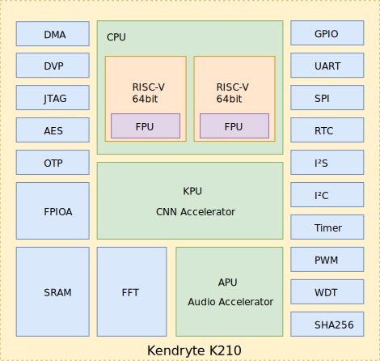

# Overview

The Kendryte K210 is a system-on-chip (SoC) that integrates machine vision and machine hearing. Using TSMC's ultra-low-power 28-nm advanced process with dual-core 64-bit processors for better power efficiency, stability and reliability. The SoC strives for "zero threshold" development and to be deployable in the user's products in the shortest possible time, giving the product artificial intelligence.

Kendryte K210 is intended for the AI and IoT markets, but is also a high-performance MCU.

Kendryte in Chinese means researching intelligence. The main application field of this chip is in the field of Internet of Things. The chip provides AI solutions to add intelligence to this.

* Machine Vision
* Machine Hearing
* Better low power vision processing speed and accuracy
* KPU high performance Convolutional Neural Network (CNN) hardware accelerator
* Advanced TSMC 28nm process, temperature range -40°C to 125°C
* Firmware encryption support
* Unique programmable IO array maximises design flexibility
* Low voltage, reduced power consumption compared to other systems with the same processing power
* 3.3V/1.8V dual voltage IO support eliminates need for level shifters

## AI solution

### Machine Vision

With machine vision capabilities, the Kendryte K210 is a zero-threshold embedded machine vision solution. It can perform convolutional neural network calculations with low power consumption.

Capabilities:

* Object Detection
* Image Classification
* Face Detection and Recognition
* Obtaining size and coordinates of target in real time
* Obtaining type of detected target in real time

### Machine Hearing

The Kendryte K210 has machine hearing capabilities. The chip comes with a high-performance microphone array audio processor for real-time source orientation and beamforming.

Capabilities:

* Sound source orientation detection
* Sound Field Imaging
* Beamforming
* Voice Wake-Up
* Speech Recognition

### Hybrid Audio/Vision Solution

The Kendryte K210 combines machine vision and machine hearing to provide even more powerful features. In the application, both the sound source localization and the sound field imaging can be used to assist the machine vision to track the target, and the general target detection can obtain the target's orientation and then assist the machine to perform the beamforming of the source. Additionally, the direction of the person can be obtained by the image transmitted from the camera, so that the microphone array is directed to the person by beamforming. At the same time, the direction of speech can be determined according to the microphone array, and the camera is rotated to point to the person.

## Architecture Overview

The K210 includes two 64-bit RISC-V CPU cores, each with a built-in independent FPU. The primary functions of the K210 are machine vision and hearing, which includes the KPU for computing convolutional neural networks and an APU for processing microphone array inputs. The K210 features a Fast Fourier Transform (FFT) Accelerator for high performance complex FFT calculations. As a result, for most machine learning algorithms, the K210 has high-performance processing power.

The K210 embeds AES and SHA256 algorithm accelerators to provide users with basic security features.

The K210 features high-performance, low-power SRAM and powerful DMA for superior data throughput.

K210 has a wide range of peripheral units: DVP, JTAG, OTP, FPIOA, GPIO, UART, SPI, RTC, I2S, I2C, WDT, Timer and PWM, for a large number of application scenarios.
