# Functional Description

## CPU

The chip contains a high-performance, low power RISC-V ISA-based dual core 64-bit CPU with
the following features:

|     Feature  |          |  Details                                             |
| ------------ | ------- | -------------------------------------------------------------- |
| Core Count     | 2 cores  | Dual-core processor, each core with indepdendnt FPU     |
| Bit Width   | 64 bit    | 64-bit CPU bit width for high-performance algorithm calculations with sufficient computational bandwidth        |
| Frequency     | 400MHz  | Frequency adjustable, can be changed by adjusting PLL VCO and frequency dividers                      |
| ISA extensions   | IMAFDC  | Based on RISC-V 64-bit IMAFDC (RV64GC), suitable for general tasks                   |
| FPU | Double Precision  | With multiply, divide and square root operations; supports single-precision and double-precision floating-point calculations |
| Platform Interrupts | PLIC    | Supports advanced interrupt management; with 64 external interrupt sources routeable to 2 cores              |
| Local Interrupts | CLINT   | With built-in CPU timer interrupt and cross-core interrupt                              |
| I-Cache     | 32KiB×2 | Cores 0 and 1 each have a 32 KiB instruction cache to improve dual-core instruction read performance     |
| D-Cache     | 32KiB×2 | Cores 0 and 1 each have a 32 KiB data cache to improve dual-core data read performance     |
| On-Chip SRAM     | 8MiB    | 8MiB of on-chip SRAM in total, see SRAM chapter for details                         |

### CPU ISA Features

- Powerful dual-core 64-bit open architecture-based processor with rich community resources
- I extension: Base Integer Instruction Set
- M extension: integer multiplication and division; hardware acceleration to achieve high performance integer multiplication and division
- A extension: atomic operations, hardware implementation of the atomic operations required by operating systems
- C extension: compressed instructions, which can achieve higher code density and operation efficiency
- Support for different privilege levels to improve safety

### FPU Specifications

- IEEE754-2008 compliant high-performance pipelined FPU
- Core 0 and Core 1 each have a separate FPU, and both cores are capable of high performance hardware floating point calculations
- F extension: single-precision floating point instructions
- D extension: double-precision floating point instructions
- Hardware single-precision and double-precision division
- Hardware single-precision and double-precision square roots

### Advanced Interrupt Management Capability

The PLIC controller of the RISC-V CPU supports flexible advanced interrupt management. It can be configured with 64 external interrupt sources in 7 priority levels. Both cores can be configured independently:

- Interrupt management and interrupt routing can be controlled independently for both cores
- Support for software interrupts, and each core can trigger cross-core interrupts
- Built-in CPU timer interrupt, both cores are freely configurable
- Advanced external interrupt management, supporting 64 external interrupt sources, each interrupt source can be configured with 7 priority levels

### Debugging Support

- Support performance monitoring instructions to count instruction execution cycles
- High-speed UART and JTAG interface for debugging
- Support DEBUG mode and hardware breakpoints

## Neural Network Processor (KPU)

KPU is a general-purpose neural network processor with built-in convolution, batch normalization, activation, and pooling operations. It can detect faces or objects in real time. The specific characteristics are as follows:

- Supports the fixed-point model that the mainstream training framework trains according to specific restriction rules
- There is no direct limit on the number of network layers, and each layer of convolutional neural network parameters can be configured separately, including the number of input and output channels, and the input and output line width and column height
- Support for 1x1 and 3x3 convolution kernels
- Support for any form of activation function
- The maximum supported neural network parameter size for real-time work is 5MiB to 5.9MiB
- The maximum supported network parameter size when working in non-real time is (flash size - software size)

|           Mode            | Maximum fixed point model size (MiB)  | Maximum pre-quantisation floating point model size（MiB） |
| :------------------------ | :---------------------- | :------------------------ |
| Realtime（≥30fps）            | 5.9                     | 11.8                      |
| Non-realtime（＜10fps）[^audio] | Flash Capacity[^flash] | Flash Capacity           |

[^audio]: Non-real-time applications generally include audio applications, as such applications generally do not require neural network output within 33 ms.
[^flash]: Flash size support：SPI NOR Flash（ 8MiB，16MiB，32MiB），SPI NAND Flash （64MiB，128MiB，256MiB)

The internal structure of the KPU is shown below.

## Audio Processor (APU)

The APU pre-processing module is responsible for the pre-processing of voice direction and voice data output. The functional characteristics of the APU pre-processing module are:

- Up to 8 channels of audio input data, ie 4 stereo channels
- Simultaneous scanning pre-processing and beamforming for sound sources in up to 16 directions
- Supports one active voice stream output
- 16-bit wide internal audio signal processing
- Support for 12-bit, 16-bit, 24-bit, and 32-bit input data widths
- Multi-channel direct raw signal output
- Up to 192kHz sample rate
- Built-in FFT unit supports 512-point FFT of audio data
- Uses system DMAC to store output data in system memory

## Static Random-Access Memory (SRAM)

The SRAM is split into two parts, 6MiB of on-chip general-purpose SRAM memory and 2MiB of on-chip AI SRAM memory, for a total of 8MiB. The AI SRAM memory is memory allocated for the KPU. They are distributed in a contiguous address space, availble both through the normal cached interface of the CPU, but also directly through the non-cached interface.

**SRAM address map：**

| Region    | Access  | Start Address   | End Address   | Size |
|----------------|-----------|------------|------------|----------|
| General-purpose SRAM | CPU cached | 0x80000000 | 0x805FFFFF | 0x600000 |
| AI SRAM  | CPU cached | 0x80600000 | 0x807FFFFF | 0x200000 |
| General-purpose SRAM | CPU non-cached | 0x40000000 | 0x405FFFFF | 0x600000 |
| AI SRAM   |  CPU non-cached | 0x40600000 | 0x407FFFFF | 0x200000 |

### General Purpose SRAM

The general purpose SRAM memory is accessible at all times during normal operation of the chip. The memory is divided into two banks, MEM0 and MEM1, and the DMA controller can operate in both banks at the same time.

** General-purpose SRAM address map：**

| Region | Access  | Start Address   | End Address   | Size |
|----------|-----------|------------|------------|----------|
| MEM0     | CPU cached | 0x80000000 | 0x803FFFFF | 0x400000 |
| MEM1     | CPU cached | 0x80400000 | 0x805FFFFF | 0x200000 |
| MEM0     | CPU non-cached  | 0x40000000 | 0x403FFFFF | 0x400000 |
| MEM1     | CPU non-cached  | 0x40400000 | 0x405FFFFF | 0x200000 |

### AI SRAM

The AI SRAM memory is only accessible if the following conditions are met:

- PLL1 enabled and clock system configuration is correct
- KPU not performing neural network calculations

**AI SRAM address map：**

| Region    | Access  | Start Address   | End Address   | Size |
|---------------|-----------|------------|------------|----------|
| AI SRAM | CPU cached | 0x80600000 | 0x807FFFFF | 0x200000 |
| AI SRAM | CPU non-cached  | 0x40600000 | 0x407FFFFF | 0x200000 |

## System Controller (SYSCTL)

Controls chip clocking and reset and contains the following general system control registers:

- PLL frequency
- Clock selection
- Peripheral clock division ratios
- Clock enables
- Module resets
- DMA handshake signal selection

## Field Programmable IO Array (FPIOA/IOMUX)

FPIOA allows users to map 255 internal functions to 48 free IOs on the chip:

- Programmable IO function selection
- 8 drive strength options for outputs
- Selectable internal pull-up resistors
- Selectable internal pull-down resistors
- Schmitt trigger option for inputs
- Slew rate control for outputs
- Selectable internal input level

## One-Time Programmable Memory (OTP)

OTP is a one-time programmable memory unit. The specifications are as follows:

- Large 128Kbit storage capacity
- Internally divided into multiple BLOCKs with different capacity; each with a seperate write protection bit
- Dead bit repair support
- 64 REGISTER_ENABLE flag bits, can be used as a switch to control the behavior of some SoC hardware circuits
- Can store 128-bit AES encryption and decryption KEY, hardware write-only trusted storage area

## AES Accelerator

The AES accelerator is a module for encryption and decryption. The specifications are as follows:

- ECB, CBC, and GCM encryption methods
- 128-bit, 192-bit or 256-bit key
- Key can be configured by software and protected by hardware circuit
- DMA transfer support

## Digital Video Port (DVP)

The DVP is a camera interface module with the following features:

- Supports cameras with a DVP interface
- Supports camera configuration using SCCB protocol
- Maximum frame size 640x480
- Supports YUV422 and RGB565 format image input
- Can output images to both KPU and display
  - Output format to KPU: RGB888 or the Y component of YUV422 input
  - Output format to display: RGB565
- Interrupt can be sent to CPU for start-of-frame or completion of frame image transmission

## FFT Accelerator

The FFT accelerator is a hardware implementation of the Fast Fourier Transform (FFT).

- 64-point, 128-point, 256-point or 512-point length
- FFT and IFFT operation modes
- 32-bit or 64-bit input data width
- Supports pure-real, pure-imaginary or complex input data
- DMA transfer support

## SHA256 Accelerater

The SHA256 accelerator is a computational unit used to calculate SHA-256:

- SHA-256 calculation
- DMA transfer support for input data

## Universal Asynchronous Transceiver (UART)

### High Speed UART：

High speed UART UARTHS(UART0)

- Baud rate up to 5Mbps
- 8-byte transmit and receive FIFO
- Programmable THRE interrupt
- Does not support hardware flow control or other modem control signals, or synchronous serial data protocols

### General Purpose UART：

UART1, UART2 and UART3 are general purpose UARTs and support asynchronous communication（RS232/RS485/IRDA), baud rate up to 5Mbps, 
hardware flow control using CTS/RTS or (XON/XOFF). All three interfaces can be accessed by DMA or directly by the CPU.

- 8-byte transmit and receive FIFO
- Asynchronous clock support
  - In order to cope with the CPU's baud rate requirement for data synchronization, the UART can configure the data clock separately for transmit and receive. The full-duplex mode can ensure the synchronization of data in the two clock domains.
- RS485 interface support
  - The UART can be configured by software into RS485 mode. The default is RS232 mode
- Programmable THRE interrupt
  - Use THRE interrupt mode to improve serial port performance. After the THRE mode and FIFO mode are selected, the THRE interrupt is triggered if there is less than the threshold in the FIFO.

## Watchdog Timer (WDT)

The WDT is a slave peripheral to the APB and is part of the "common hardware component design." It has two WDTs: WDT0, WDT1.
The watchdog timer contains the following modules:

- An APB slave interface
- A register module that synchronizes the current counter
- An interrupt/system reset module and logic control circuit with down counter
- A synchronous clock domain to support asynchronous clock synchronization

The watchdog timer supports the following settings:

- APB bus width can be configured to 8, 16, and 32 bits
- The clock counter is decremented from a certain set value to 0 to indicate timeout
- Optional external clock enable signal to control the counter's count rate
- Upon clock timeout the WDT can perform the following tasks:
  - Generate a system reset signal
  - First generate an interrupt, even if the bit has been cleared by the interrupt service, and subsequently it will generate a system reset signal.
- Configurable duty cycle
- Programmable or hardware set counter start value
- Counter reset protection
- Pause mode, when the external pause signal is enabled
- WDT accidental disable protection
- Test mode for counter function test (decrement operation)
- External asynchronous clock support. When this function is enabled, a clock interrupt and a system reset signal will be generated even if the APB bus clock is off.

## General Purpose Input/Output Interface (GPIO)

### High speed GPIO:

There are a total of 32 high-speed GPIO (GPIOHS). They have the following characteristics:

- Configurable as input or output
- Each IO is an independent interrupt source
- Edge-triggered or level-triggered interrupt support
- Each IO can be assigned to one of the 48 pins on the FPIOA
- Configurable pull-up and pull-down resistors, or high impedance mode

### General purpose GPIO：

There are 8 general-purpose GPIOs with the following characteristics:

- All 8 IOs are one interrupt source
- Configurable as input or output
- Edge-triggered or level-triggered interrupt support
- Each IO can be assigned to one of the 48 pins on the FPIOA
- Configurable pull-up and pull-down resistors, or high impedance mode

## Direct Memory Access Controller (DMAC)

The DMAC is highly configurable, highly programmable, and highly efficient at transferring data in bus mode. The DMAC controller supports multi-master and multi-channel.
DMAC has the following features:

- Memory-memory, memory-peripheral, peripheral-memory or peripheral-peripheral transfers
- Independent core and slave clocks
- The main interface can turn off its clock to save power when all peripherals are inactive
- Up to eight channels, each with their own source and destination pair
- Each channel data can only transmit in one direction at a time
- Input pin can dynamically select the destination size
- Channel lock support, support for internal channel arbitration, sets the privilege values of the main interface bus based on the priority of data transfer
- DMAC status output, idle/busy indication
- Each DMA transfer has interrupted, transmission completed, etc. status

## Inter-Integrated Circuit Bus (I²C)

There are three I²C bus interfaces, each configurable as master or slave by the user.

- Standard mode (0 to 100Kb/s)
- Fast mode (<= 400Kb/s)
- 7-bit/10-bit addressing mode
- Bulk transfer mode
- Interrupt or polling mode operation

## Serial Peripheral Interface (SPI)

There are four SPI interfaces; of which SPI0, SPI1 and SPI3 only support MASTER mode, and SPI2 only supports SLAVE mode.

- Support for 1/2/4/8 wire full duplex mode
- SPI0, SPI1, and SPI2 support up to 25MHz clock (TBC)
- SPI3 supports up to 100MHz clock (TBC)
- 32-bit wide, 32-byte deep FIFO
- Independently Masked Interrupts: host conflict, transmit FIFO overflow, transmit FIFO empty, receive FIFO full, receive FIFO underflow, receive FIFO overflow
- Support for DMA transfers
- Support for dual-edge DDR transmission mode
- SPI3 supports XIP

## Inter-Integrated Sound (I²S)

There are 3 I²S interfaces on board (I2S0, I2S1 and I2S20, all of which only support MASTER mode. I2S0 can be connected to the voice processing module to enable voice enhancement and sound source
orientation. All interfaces support the following other features:

- 8-bit, 16-bit or 32-bit configurable bus width
- Up to 4 stereo channels per interface
- Supports full-duplex communication, indepedent transmitter and reciever
- APB bus clock and I²S SCLK are asynchronous
- 12-bit, 16-bit, 20-bit, 24-bit or 32-bit audio data resolution
- I²S0 has a 64-byte deep transmit FIFO and 8-byte deep receive FIFO. Other interfaces have 8-byte deep transmit and receive FIFOs
- Support for DMA transfers
- Programmable FIFO threshold

## TIMER

The system has three TIMER modules with the following characteristics:

- 32-bit counter width
- Configurable as up or down counter
- Independent clocks
- Configurable polarity for each interrupt
- Configurable individual or combined interrupt output flags 
- Each timer has a read/write consistent register
- Timer reload output, switches whenever the timer counter is reloaded
- Output PWM mode，0％-100% duty cycle

## Read Only Memory (ROM)

The AXI ROM is responsible for copying the user's application program from SPI FLASH to the SRAM of the chip.

- Support for AES-128-CBC firmware decryption
- UOP mode to program FLASH
- SHA256 firmware integrity check for tamper resistance
- OTP configurable to disable UOP mode, SHA256 check, and AES decryption
- Support for entering TURBO mode, which enables the chip and its peripherals to run at higher frequencies during startup

## Real Time Clock (RTC)

The RTC is a module for keeping track of real time, with the following characteristics:

- Support for external high frequency crystal reference
- Configurable external crystal frequency and frequency division ratio
- Configurable perpetual calendar, configurable items including century, year, month, day, hour, minute, second and week
- Can count in seconds and query current time
- Supports setting a set of alarms. The configurable items include year, month, day, hour, minute, and second. When the alarm arrives, the interrupt is triggered.
- Interrupt configurable to support daily, hourly, minute, and second trigger interrupts
- Readout counter count resolution less than 1 second, the resolution is one period of the external crystal oscillator
- Data cleared after power-on/reset

## Pulse Width Modulation (PWM)

The PWM module is used to control the duty cycle of an external pulse output.

The user can configure the following functions of the PWM timer module:

- Frequency of pulses, by specifying the PWM timer frequency or period
- PWM timers can be configured to synchronize with other PWM timers or modules
- PWM timers can be in phase with other PWM timers or modules
- Timer count mode: up, down, or up and down in a loop
- Use the prescaler to change the rate of the PWM timer clock (PT\_clk). Each timer has its own prescaler, configured by PWM\_TIMERx\_PRESCALE in the register PWM\_TIMER0\_CFG0\_REG. The PWM timer is incremented or decremented at a slower rate depending on the setting of this register.
