# 功能描述

## 中央处理器 (CPU)

本芯片搭载基于 RISC-V ISA 的双核心64位的高性能低功耗CPU，具备以下特性：

|     项目     |  内容   |                              描述                              |
| ------------ | ------- | -------------------------------------------------------------- |
| 核心数量     | 2 核心  | 双核对等，各个核心具备独立FPU                                  |
| 处理器位宽   | 64位    | 64位CPU位宽，为高性能算法计算提供位宽基础，计算带宽充足        |
| 标称频率     | 400MHz  | 频率可调，可通过调整PLL VCO与分频进行变频                      |
| 指令集扩展   | IMAFDC  | 基于RISC-V 64位IMAFDC (RV64GC)，胜任通用任务                   |
| 浮点处理单元 | 双精度  | 具备乘法器、除法器与平方根运算器，支持单精度、双精度的浮点计算 |
| 平台中断管理 | PLIC    | 支持高级中断管理，支持64个外部中断源路由到2个核心              |
| 本地中断管理 | CLINT   | 支持CPU内置定时器中断与跨核心中断                              |
| 指令缓存     | 32KiB×2 | 核心0与核心1各具有32千字节的指令缓存，提升双核指令读取效能     |
| 数据缓存     | 32KiB×2 | 核心0与核心1各具有32千字节的数据缓存，提升双核数据读取效能     |
| 片上SRAM     | 8MiB    | 共计8兆字节的片上SRAM，详细见SRAM章节                          |

### CPU指令特点

- 强大的双核64位基于开放架构的处理器，具备丰富的社区资源支持
- 支持I扩展，即基本整数指令集(Base Integer Instruction Set)扩展
- 支持M扩展，即整数乘除扩展，可硬件加速实现高性能整数乘除
- 支持A扩展，即原子操作扩展，可硬件实现软件与操作系统需要的原子操作
- 支持C扩展，即压缩指令扩展，可通过编译器压缩指令实现更高的代码密度与运行效率
- 支持不同特权等级，可分特权执行指令，更安全

### FPU与浮点计算能力

- FPU满足IEEE754-2008标准，计算流程以流水线方式进行，具备很强的运算能力
- 核心0与核心1各具备独立FPU，两个核心皆可胜任高性能硬件浮点计算
- 支持F扩展，即单精度浮点扩展，CPU内嵌的FPU支持单精度浮点硬件加速
- 支持D扩展，即双精度浮点扩展，CPU内嵌的FPU支持双精度浮点硬件加速
- FPU具备除法器，支持单精度、双精度的浮点的硬件除法运算
- FPU具备平方根运算器，支持单精度、双精度的浮点的硬件平方根运算

### 高级中断管理能力

该RISC-V CPU的PLIC控制器支持灵活的高级中断管理，可分7个优先级配置64个外部中断源，两个核心都可独立进行配置:

- 可对两个核心独立进行中断管理与中断路由控制
- 支持软件中断，并且双核心可以相互触发跨核心中断
- 支持CPU内置定时器中断，两个核心都可自由配置
- 高级外部中断管理，支持64个外部中断源，每个中断源可配置7个优先级

### 调试能力

- 支持性能监控指令，可统计指令执行周期
- 具备用以调试的高速UART与JTAG接口
- 支持DEBUG模式以及硬件断点

## 神经网络处理器 (KPU)

KPU是通用神经网络处理器，内置卷积、批归一化、激活、池化运算单元，可以对人脸或物体进行实时检测，具体特性如下：

- 支持主流训练框架按照特定限制规则训练出来的定点化模型
- 对网络层数无直接限制，支持每层卷积神经网络参数单独配置，包括输入输出通道数目、输入输出行宽列高
- 支持两种卷积内核1x1和3x3
- 支持任意形式的激活函数
- 实时工作时最大支持神经网络参数大小为5.5MiB到5.9MiB
- 非实时工作时最大支持网络参数大小为（Flash容量-软件体积）

|           工况            | 最大定点模型大小 (MiB)  | 量化前浮点模型大小（MiB） |
| :------------------------ | :---------------------- | :------------------------ |
| 实时（≥30fps）            | 5.9                     | 11.8                      |
| 非实时（＜10fps）[^audio] | 与Flash容量相关[^flash] | 与Flash容量相关           |

[^audio]: 非实时场合一般用于音频应用，这类应用一般不需要33ms内获得神经网络输出结果。
[^flash]: Flash大小可选择为：SPI NOR Flash（ 8MiB，16MiB，32MiB），SPI NAND Flash （64MiB，128MiB，256MiB），用户可根据需要选择合适的Flash.

KPU的内部结构如下图所示。

## 音频处理器 (APU)

APU前处理模块负责语音方向扫描和语音数据输出的前置处理工作。APU前处理模块的功能特性有：

- 可以支持最多8路音频输入数据流，即4路双声道
- 可以支持多达16个方向的声源同时扫描预处理与波束形成
- 可以支持一路有效的语音数据流输出
- 内部音频信号处理精度达到16-位
- 输入音频信号支持12-位，16-位，24-位，32-位精度
- 支持多路原始信号直接输出
- 可以支持高达192K采样率的音频输入
- 内置FFT变换单元，可对音频数据提供512点快速傅里叶变换
- 利用系统DMAC将输出数据存储到SoC的系统内存中

## 静态随机存取存储器 (SRAM)

SRAM包含两个部分，分别是6MiB的片上通用SRAM存储器与2MiB的片上AI SRAM存储器，共计8MiB（1MiB为1兆字节）。其中，AI SRAM存储器是专为KPU分配的存储器。它们分布在连续的地址空间中，不仅可以通过经由CPU的缓存接口访问，而且可以通过非缓存接口直接访问。

**SRAM映射分布：**

| 模块名称       | 映射类型  | 开始地址   | 结束地址   | 空间大小 |
|----------------|-----------|------------|------------|----------|
| 通用SRAM存储器 | 经CPU缓存 | 0x80000000 | 0x805FFFFF | 0x600000 |
| AI SRAM存储器  | 经CPU缓存 | 0x80600000 | 0x807FFFFF | 0x200000 |
| 通用SRAM存储器 | 非CPU缓存 | 0x40000000 | 0x405FFFFF | 0x600000 |
| AI SRAM存储器  | 非CPU缓存 | 0x40600000 | 0x407FFFFF | 0x200000 |

### 通用SRAM存储器

通用SRAM存储器在芯片正常工作的任意时刻都可以访问。该存储器分为两个Bank，分别为MEM0与MEM1，并且DMA控制器可同时操作不同Bank。

**通用SRAM存储器地址空间：**

| 模块名称 | 映射类型  | 开始地址   | 结束地址   | 空间大小 |
|----------|-----------|------------|------------|----------|
| MEM0     | 经CPU缓存 | 0x80000000 | 0x803FFFFF | 0x400000 |
| MEM1     | 经CPU缓存 | 0x80400000 | 0x805FFFFF | 0x200000 |
| MEM0     | 非CPU缓存 | 0x40000000 | 0x403FFFFF | 0x400000 |
| MEM1     | 非CPU缓存 | 0x40400000 | 0x405FFFFF | 0x200000 |

### AI SRAM存储器

AI SRAM存储器仅在以下条件都满足时才可访问：

- PLL1 已使能，时钟系统配置正确
- KPU 没有在进行神经网络计算

**AI SRAM存储器地址空间：**

| 模块名称      | 映射类型  | 开始地址   | 结束地址   | 空间大小 |
|---------------|-----------|------------|------------|----------|
| AI SRAM存储器 | 经CPU缓存 | 0x80600000 | 0x807FFFFF | 0x200000 |
| AI SRAM存储器 | 非CPU缓存 | 0x40600000 | 0x407FFFFF | 0x200000 |

## 系统控制器 (SYSCTL)

控制芯片的时钟，复位和系统控制寄存器：

- 配置PLL的频率
- 配置时钟选择
- 配置外设时钟的分频比
- 控制时钟使能
- 控制模块复位
- 选择DMA握手信号

## 现场可编程IO阵列 (FPIOA/IOMUX)

FPIOA允许用户将255个内部功能映射到芯片外围的48个自由IO上：

- 支持IO的可编程功能选择
- 支持IO输出的8种驱动能力选择
- 支持IO的内部上拉电阻选择
- 支持IO的内部下拉电阻选择
- 支持IO输入的内部施密特触发器设置
- 支持IO输出的斜率控制
- 支持内部输入逻辑的电平设置

## 一次性可编程存储器 (OTP)

OTP是一次性可编程存储器单元，具体应用特性如下：

- 具有128Kbit的大容量存储空间
- 内部划分多个容量不同的BLOCK，每个BLOCK对应一个写保护位，可以单独进行写保护操作
- 具有坏点修复功能
- 内部存储了64个REGISTER_ENABLE标志位，可以作为控制某些SoC的硬件电路行为的开关
- 可以存储128位的AES加密和解密需要的KEY，由硬件实现只写可信存储区

## 高级加密加速器 (AES Accelerater)

AES加速器是用来加密和解密的模块，具体性能如下：

- 支持ECB，CBC，GCM三种加密方式
- 支持128位，192位，256位三种长度的KEY
- KEY可以通过软件配置，受到硬件电路保护
- 支持DMA传输

## 数字视频接口 (DVP)

DVP是摄像头接口模块，特性如下：

- 支持DVP接口的摄像头
- 支持SCCB协议配置摄像头寄存器
- 最大支持640X480及以下分辨率，每帧大小可配置
- 支持YUV422和RGB565格式的图像输入
- 支持图像同时输出到KPU和显示屏:
  - 输出到KPU的格式可选RGB888，或YUV422输入时的Y分量
  - 输出到显示屏的格式为RGB565
- 检测到一帧开始或一帧图像传输完成时可向CPU发送中断

## 快速傅里叶变换加速器 (FFT Accelerater)

FFT加速器是用硬件的方式来实现FFT的基2时分运算。

- 支持多种运算长度，即支持64点、128点、256点以及512点运算
- 支持两种运算模式，即FFT以及IFFT运算
- 支持可配的输入数据位宽，即支持32位及64位输入
- 支持可配的输入数据排列方式，即支持虚部、实部交替，纯实部以及实部、虚部分离三种数据排列方式
- 支持DMA传输

## 安全散列算法加速器 (SHA256 Accelerater)

SHA256加速器是用来计算SHA-256的计算单元：

- 支持SHA-256的计算
- 支持输入数据的DMA传输

## 通用异步收发传输器 (UART)

### 高速UART：

高速UART为UARTHS(UART0)

- 通信速率可达5Mbps
- 8字节发送和接收FIFO
- 可编程式THRE中断
- 不支持硬件流控制或其他调制解调器控制信号，或同步串行数据转换器

### 通用UART：

通用UART为UART1、UART2和UART3，支持异步通信（RS232和RS485和IRDA，通信速率可达到5Mbps。 UART支持CTS和RTS信号的硬件管理以及软件流控(XON和XOFF)。3个接口均可被DMA访问或者CPU直接访问。

- 8字节发送和接收FIFO
- 异步时钟支持
  - 为了应对CPU对于数据同步的对波特率的要求, UART可以单独配置数据时钟.全双工模式能保证两个时钟域中数据的同步
- RS485接口支持
  - UART可以配置为软件可编程式RS485模式。默认为RS232模式
- 可编程式THRE中断
  - 用THRE中断模式来提升串口性能。当THRE模式和FIFO模式被选择之后，如果FIFO中少于阈值便触发THRE中断

## 看门狗定时器 (WDT)

WDT是APB的一种从外设，并且也是“同步化硬件组件设计”的组成部分。具有两个WDT,分别为WDT0、WDT1
看门狗定时器主要包含模块有：

- 一个APB从接口
- 一个当前计数器同步的寄存器模块
- 一个随着计数器递减的中断/系统重置模块和逻辑控制电路
- 一个同步时钟域来为异步时钟同步做支持

看门狗定时器支持如下设置：

- APB总线宽度可配置为8、16和32位
- 时钟计数器从某一个设定的值递减到0来指示时间的计时终止
- 可选择的外部时钟使能信号，用于控制计数器的计数速率
- 一个时钟超时WDT可以执行以下任务：
  - 产生一个系统复位信号
  - 首先产生一个中断，即使该位是否已经被中断服务清除，其次它会产生一个系统复位信号
- 占空比可编程调节
- 可编程和硬件设定计数器起始值
- 计数器重新计时保护
- 暂停模式，仅当使能外部暂停信号时
- WDT偶然禁用保护
- 测试模式，用来进行计数器功能测试（递减操作）
- 外部异步时钟支持。当该项功能启用时，将会产生时钟中断和系统重置信号，即使APB总线时钟关闭的情况下

## 通用输入/输出接口 (GPIO)

### 高速GPIO：

高速GPIO为GPIOHS，共32个。具有如下特点：

- 可配置输入输出信号
- 每个IO具有独立中断源
- 中断支持边沿触发和电平触发
- 每个IO可以分配到FPIOA上48个管脚之一
- 可配置上下拉，或者高阻

### 通用GPIO：

通用GPIO共8个，具有如下特点:

- 8个IO使用一个中断源
- 可配置输入输出信号
- 可配置触发IO总中断，边沿触发和电平触发
- 每个IO可以分配到FPIOA上48个管脚之一
- 可配置上下拉，或者高阻

## 直接内存存取控制器 (DMAC)

DMAC 具有高度可配置化，高度可编程，在总线模式下传输数据具有高效率，DMAC控制器具有多主机，多频道等特点。
DMAC具有如下特点：

- 内存-内存，内存-外设，外设-内存，外设-外设的DMA传输
- 具有独立的核心，主接口和从接口独立时钟
- 当所有外设不活动时主接口可以关闭其时钟来省电
- 多达八个通道，每路通道都有源和目的地对
- 每个通道数据传输数据时每个时刻只能有一个方向传输，不同通道则不受影响
- 输入管脚可以动态选择大小端制式
- 通道锁支持，支持内部通道仲裁，根据数据传输的优先级来使用主接口总线的特权
- DMAC 状态输出，空闲/忙指示
- DMA传输分配成传输中，被中断，传输完成等传输等级

## 集成电路内置总线 (I²C)

集成电路总线有3个I²C总线接口，根据用户的配置，总线接口可以用作I²C MASTER或SLAVE模式。
I²C接口支持：

- 标准模式（0到100Kb/s）
- 快速模式（<= 400Kb/s）
- 7-位/10-位 寻址模式
- 批量传输模式
- 中断或轮询模式操作

## 串行外设接口 (SPI)

串行外设接口有4组SPI接口，其中SPI0、SPI1、SPI3只能工作在MASTER模式，SPI2只能工作在SLAVE模式，他们有如下特性：

- 支持1/2/4/8线全双工模式
- SPI0、SPI1、SPI2可支持25MHz时钟（待测更新）
- SPI3最高可支持100MHz时钟（待测更新）
- 支持32位宽、32BYTE深的FIFO
- 独立屏蔽中断 - 主机冲突，发送FIFO溢出，发送FIFO空， 接收FIFO满，接收FIFO下溢，接收FIFO溢出中断都可以被屏蔽独立
- 支持DMA功能
- 支持双沿的DDR传输模式
- SPI3 支持XIP

## 集成电路内置音频总线 (I²S)

集成电路内置音频总线共有3个(I²S0、I²S1、I²S2)，都是MASTER模式。其中I²S0支持可配置连接语音处理模块，实现语音增强和声源定向的功能。下面是一些共有的特性：

- 总线宽度可配置为8，16，和32位
- 每个接口最多支持4个立体声通道
- 由于发送器和接收器的独立性，所以支持全双工通讯
- APB总线和I²S SCLK的异步时钟
- 音频数据分辨率为12,16,20,24和32位
- I²S0发送FIFO深度为64字节,接收为8字节，I²S1和I²S2的发送和接收FIFO深度都为8字节
- 支持DMA传输
- 可编程FIFO阈值

## 定时器 (TIMER)

系统有3个TIMER模块，它们有如下特性：

- 32位计数器宽度
- 可配置的向上／向下时基计数器：增加或减少
- 时钟独立可配
- 每个中断的可配置极性
- 单个或组合中断输出标志可配置
- 每个定时器有读/写一致性寄存器
- 定时器切换输出，每当定时器计数器重新加载时切换
- 定时器切换输出的脉冲宽度调制(PWM)，0％到100%占空比

## 只读存储器 (ROM)

AXI ROM负责从SPI FLASH中拷贝程序至芯片的SRAM中。

- 支持固件AES-128-CBC解密
- 支持UOP模式烧写FLASH的程序
- 支持固件SHA256完整性校验防篡改
- 支持OTP中禁用掉UOP模式，SHA256校验，AES解密
- 支持进入TURBO模式，可以使得启动时芯片及其外设以较高频率运行

## 实时时钟 (RTC)

RTC是用来计时的单元，在设置时间后具备计时功能：

- 可使用外部高频晶振进行计时
- 可配置外部晶振频率与分频
- 支持万年历配置，可配置的项目包含世纪、年、月、日、时、分、秒与星期
- 可按秒进行计时，并查询当前时刻
- 支持设置一组闹钟，可配置的项目包含年、月、日、时、分、秒，闹钟到达时触发中断
- 中断可配置，支持每日、每时、每分、每秒触发中断
- 可读出小于1秒的计数器计数值，最小刻度单位为外部晶振的单个周期
- 上电/复位后数据清零

## 脉冲宽度调制器 (PWM)

PWM用于控制脉冲输出的占空比。

用户可配置 PWM 定时器模块的以下功能：

- 通过指定 PWM 定时器频率或周期来控制事件发生的频率
- 配置特定 PWM 定时器与其他 PWM 定时器或模块同步
- 使 PWM 定时器与其他 PWM 定时器或模块同相
- 设置定时器计数模式：递增，递减，或递增递减循环计数模式
- 使用预分频器更改 PWM 定时器时钟（PT\_clk）的速率。每个定时器都有自己的预分频器，通过寄存器PWM\_TIMER0\_CFG0\_REG 的PWM\_TIMERx\_PRESCALE 配置。PWM 定时器根据该寄存器的设置以较慢的速度递增或递减