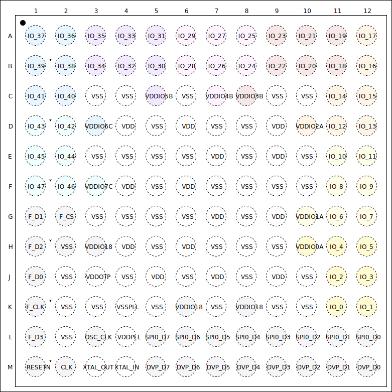

# 引腳定義

K210 使用精心設計的引腳佈局，確保信號都在BGA外圈，以方便PCB工程師進行扇出與布線，提升電氣性能，降低設計難度。

由於K210包含多種電源域的IO信號，並且不同電源域可能會有不同的電壓，以下將會對使用的電源域進行列表說明：

| 電源域組 |  電源域  | 支持電壓（V） |      互聯特性      | 電源名稱 |
| -------- | -------- | ------------- | ------------------ | -------- |
| A        | 0        | 3.3或1.8      | 組內互聯，組間獨立 | VDDIO0A  |
| A        | 1        | 3.3或1.8      | 組內互聯，組間獨立 | VDDIO1A  |
| A        | 2        | 3.3或1.8      | 組內互聯，組間獨立 | VDDIO2A  |
| B        | 3        | 3.3或1.8      | 組內互聯，組間獨立 | VDDIO3B  |
| B        | 4        | 3.3或1.8      | 組內互聯，組間獨立 | VDDIO4B  |
| B        | 5        | 3.3或1.8      | 組內互聯，組間獨立 | VDDIO5B  |
| C        | 6        | 3.3或1.8      | 組內互聯，組間獨立 | VDDIO6C  |
| C        | 7        | 3.3或1.8      | 組內互聯，組間獨立 | VDDIO7C  |
| 低壓IO   | 低壓IO   | 1.8           | 無特殊要求         | VDDIO18  |
| OTP      | OTP      | 1.8           | 無特殊要求         | VDDOTP   |
| PLL      | PLL      | 0.9           | 無特殊要求         | VDDPLL   |
| 數字核心 | 數字核心 | 0.9           | 無特殊要求         | VDD      |

## 引腳佈局

晶元的引腳定義如上圖（頂視圖，錫球朝向下方）。
該晶元使用BGA144封裝，正方形，每一邊有12個引腳。晶元寬度為8mm，長度為8mm，高度為0.953mm.

## 引腳描述

| 編號  |   名稱    | 類型  |                        功能                        |  復位後初始狀態   |
| :---: | :-------: | :---: | :------------------------------------------------- | :---------------: |
|  A1   |  IO\_37   |  I/O  | 可編程IO陣列（FPIOA）的多功能IO（電源域6，組C）    |     GPIOHS21      |
|  A2   |  IO\_36   |  I/O  | 可編程IO陣列（FPIOA）的多功能IO（電源域6，組C）    |     GPIOHS20      |
|  A3   |  IO\_35   |  I/O  | 可編程IO陣列（FPIOA）的多功能IO（電源域5，組B）    |     GPIOHS19      |
|  A4   |  IO\_33   |  I/O  | 可編程IO陣列（FPIOA）的多功能IO（電源域5，組B）    |     GPIOHS17      |
|  A5   |  IO\_31   |  I/O  | 可編程IO陣列（FPIOA）的多功能IO（電源域5，組B）    |     GPIOHS15      |
|  A6   |  IO\_29   |  I/O  | 可編程IO陣列（FPIOA）的多功能IO（電源域4，組B）    |     GPIOHS13      |
|  A7   |  IO\_27   |  I/O  | 可編程IO陣列（FPIOA）的多功能IO（電源域4，組B）    |     GPIOHS11      |
|  A8   |  IO\_25   |  I/O  | 可編程IO陣列（FPIOA）的多功能IO（電源域4，組B）    |      GPIOHS9      |
|  A9   |  IO\_23   |  I/O  | 可編程IO陣列（FPIOA）的多功能IO（電源域3，組B）    |      GPIOHS7      |
|  A10  |  IO\_21   |  I/O  | 可編程IO陣列（FPIOA）的多功能IO（電源域3，組B）    |      GPIOHS5      |
|  A11  |  IO\_19   |  I/O  | 可編程IO陣列（FPIOA）的多功能IO（電源域3，組B）    |      GPIOHS3      |
|  A12  |  IO\_17   |  I/O  | 可編程IO陣列（FPIOA）的多功能IO（電源域2，組A）    |      GPIOHS1      |
|  B1   |  IO\_39   |  I/O  | 可編程IO陣列（FPIOA）的多功能IO（電源域6，組C）    |     GPIOHS23      |
|  B2   |  IO\_38   |  I/O  | 可編程IO陣列（FPIOA）的多功能IO（電源域6，組C）    |     GPIOHS22      |
|  B3   |  IO\_34   |  I/O  | 可編程IO陣列（FPIOA）的多功能IO（電源域5，組B）    |     GPIOHS18      |
|  B4   |  IO\_32   |  I/O  | 可編程IO陣列（FPIOA）的多功能IO（電源域5，組B）    |     GPIOHS16      |
|  B5   |  IO\_30   |  I/O  | 可編程IO陣列（FPIOA）的多功能IO（電源域5，組B）    |     GPIOHS14      |
|  B6   |  IO\_28   |  I/O  | 可編程IO陣列（FPIOA）的多功能IO（電源域4，組B）    |     GPIOHS12      |
|  B7   |  IO\_26   |  I/O  | 可編程IO陣列（FPIOA）的多功能IO（電源域4，組B）    |     GPIOHS10      |
|  B8   |  IO\_24   |  I/O  | 可編程IO陣列（FPIOA）的多功能IO（電源域4，組B）    |      GPIOHS8      |
|  B9   |  IO\_22   |  I/O  | 可編程IO陣列（FPIOA）的多功能IO（電源域3，組B）    |      GPIOHS6      |
|  B10  |  IO\_20   |  I/O  | 可編程IO陣列（FPIOA）的多功能IO（電源域3，組B）    |      GPIOHS4      |
|  B11  |  IO\_18   |  I/O  | 可編程IO陣列（FPIOA）的多功能IO（電源域3，組B）    |      GPIOHS2      |
|  B12  |  IO\_16   |  I/O  | 可編程IO陣列（FPIOA）的多功能IO（電源域2，組A）    |  GPIOHS0（ISP）   |
|  C1   |  IO\_41   |  I/O  | 可編程IO陣列（FPIOA）的多功能IO（電源域6，組C）    |     GPIOHS25      |
|  C2   |  IO\_40   |  I/O  | 可編程IO陣列（FPIOA）的多功能IO（電源域6，組C）    |     GPIOHS24      |
|  C3   |    VSS    |   S   | 接地                                               |        VSS        |
|  C4   |    VSS    |   S   | 接地                                               |        VSS        |
|  C5   |  VDDIO5B  |   S   | 3.3V/1.8V電源，為FPIOA多功能IO供電（電源域5，組B） |      VDDIO33      |
|  C6   |    VSS    |   S   | 接地                                               |        VSS        |
|  C7   |  VDDIO4B  |   S   | 3.3V/1.8V電源，為FPIOA多功能IO供電（電源域4，組B） |      VDDIO33      |
|  C8   |  VDDIO3B  |   S   | 3.3V/1.8V電源，為FPIOA多功能IO供電（電源域3，組B） |      VDDIO33      |
|  C9   |    VSS    |   S   | 接地                                               |        VSS        |
|  C10  |    VSS    |   S   | 接地                                               |        VSS        |
|  C11  |  IO\_14   |  I/O  | 可編程IO陣列（FPIOA）的多功能IO（電源域2，組A）    |       GPIO6       |
|  C12  |  IO\_15   |  I/O  | 可編程IO陣列（FPIOA）的多功能IO（電源域2，組A）    |       GPIO7       |
|  D1   |  IO\_43   |  I/O  | 可編程IO陣列（FPIOA）的多功能IO（電源域7，組C）    |     GPIOHS27      |
|  D2   |  IO\_42   |  I/O  | 可編程IO陣列（FPIOA）的多功能IO（電源域7，組C）    |     GPIOHS26      |
|  D3   |  VDDIO6C  |   S   | 3.3V/1.8V電源，為FPIOA多功能IO供電（電源域6，組C） |      VDDIO33      |
|  D4   |    VDD    |   S   | 0.9V電源，為晶元數字核心供電                       |        VDD        |
|  D5   |    VSS    |   S   | 接地                                               |        VSS        |
|  D6   |    VDD    |   S   | 0.9V電源，為晶元數字核心供電                       |        VDD        |
|  D7   |    VSS    |   S   | 接地                                               |        VSS        |
|  D8   |    VSS    |   S   | 接地                                               |        VSS        |
|  D9   |    VDD    |   S   | 0.9V電源，為晶元數字核心供電                       |        VDD        |
|  D10  |  VDDIO2A  |   S   | 3.3V/1.8V電源，為FPIOA多功能IO供電（電源域2，組A） |      VDDIO33      |
|  D11  |  IO\_12   |  I/O  | 可編程IO陣列（FPIOA）的多功能IO（電源域2，組A）    |       GPIO4       |
|  D12  |  IO\_13   |  I/O  | 可編程IO陣列（FPIOA）的多功能IO（電源域2，組A）    |       GPIO5       |
|  E1   |  IO\_45   |  I/O  | 可編程IO陣列（FPIOA）的多功能IO（電源域7，組C）    |     GPIOHS29      |
|  E2   |  IO\_44   |  I/O  | 可編程IO陣列（FPIOA）的多功能IO（電源域7，組C）    |     GPIOHS28      |
|  E3   |    VSS    |   S   | 接地                                               |        VSS        |
|  E4   |    VSS    |   S   | 接地                                               |        VSS        |
|  E5   |    VSS    |   S   | 接地                                               |        VSS        |
|  E6   |    VSS    |   S   | 接地                                               |        VSS        |
|  E7   |    VDD    |   S   | 0.9V電源，為晶元數字核心供電                       |        VDD        |
|  E8   |    VSS    |   S   | 接地                                               |        VSS        |
|  E9   |    VDD    |   S   | 0.9V電源，為晶元數字核心供電                       |        VDD        |
|  E10  |    VSS    |   S   | 接地                                               |        VSS        |
|  E11  |  IO\_10   |  I/O  | 可編程IO陣列（FPIOA）的多功能IO（電源域1，組A）    |       GPIO2       |
|  E12  |  IO\_11   |  I/O  | 可編程IO陣列（FPIOA）的多功能IO（電源域1，組A）    |       GPIO3       |
|  F1   |  IO\_47   |  I/O  | 可編程IO陣列（FPIOA）的多功能IO（電源域7，組C）    |     GPIOHS31      |
|  F2   |  IO\_46   |  I/O  | 可編程IO陣列（FPIOA）的多功能IO（電源域7，組C）    |     GPIOHS30      |
|  F3   |  VDDIO7C  |   S   | 3.3V/1.8V電源，為FPIOA多功能IO供電（電源域7，組C） |      VDDIO33      |
|  F4   |    VDD    |   S   | 0.9V電源，為晶元數字核心供電                       |        VDD        |
|  F5   |    VSS    |   S   | 接地                                               |        VSS        |
|  F6   |    VDD    |   S   | 0.9V電源，為晶元數字核心供電                       |        VDD        |
|  F7   |    VSS    |   S   | 接地                                               |        VSS        |
|  F8   |    VSS    |   S   | 接地                                               |        VSS        |
|  F9   |    VSS    |   S   | 接地                                               |        VSS        |
|  F10  |    VSS    |   S   | 接地                                               |        VSS        |
|  F11  |   IO\_8   |  I/O  | 可編程IO陣列（FPIOA）的多功能IO（電源域1，組A）    |       GPIO0       |
|  F12  |   IO\_9   |  I/O  | 可編程IO陣列（FPIOA）的多功能IO（電源域1，組A）    |       GPIO1       |
|  G1   |   F\_D1   |  I/O  | SPI專用GPIO（支持電平為1.8V，不可切換）            |       F\_D1       |
|  G2   |   F\_CS   |   O   | SPI專用GPIO（支持電平為1.8V，不可切換）            |       F\_CS       |
|  G3   |    VSS    |   S   | 接地                                               |        VSS        |
|  G4   |    VSS    |   S   | 接地                                               |        VSS        |
|  G5   |    VSS    |   S   | 接地                                               |        VSS        |
|  G6   |    VSS    |   S   | 接地                                               |        VSS        |
|  G7   |    VDD    |   S   | 0.9V電源，為晶元數字核心供電                       |        VDD        |
|  G8   |    VSS    |   S   | 接地                                               |        VSS        |
|  G9   |    VDD    |   S   | 0.9V電源，為晶元數字核心供電                       |        VDD        |
|  G10  |  VDDIO1A  |   S   | 3.3V/1.8V電源，為FPIOA多功能IO供電（電源域1，組A） |      VDDIO33      |
|  G11  |   IO\_6   |  I/O  | 可編程IO陣列（FPIOA）的多功能IO（電源域1，組A）    |     (FLOAT*)      |
|  G12  |   IO\_7   |  I/O  | 可編程IO陣列（FPIOA）的多功能IO（電源域1，組A）    |     (FLOAT*)      |
|  H1   |   F\_D2   |  I/O  | SPI專用GPIO（支持電平為1.8V，不可切換）            |       F\_D2       |
|  H2   |    VSS    |   S   | 接地                                               |        VSS        |
|  H3   |  VDDIO18  |   S   | 1.8V電源，為低壓GPIO供電                           |      VDDIO18      |
|  H4   |    VDD    |   S   | 0.9V電源，為晶元數字核心供電                       |        VDD        |
|  H5   |    VSS    |   S   | 接地                                               |        VSS        |
|  H6   |    VDD    |   S   | 0.9V電源，為晶元數字核心供電                       |        VDD        |
|  H7   |    VSS    |   S   | 接地                                               |        VSS        |
|  H8   |    VSS    |   S   | 接地                                               |        VSS        |
|  H9   |    VSS    |   S   | 接地                                               |        VSS        |
|  H10  |  VDDIO0A  |   S   | 3.3V/1.8V電源，為FPIOA多功能IO供電(電源域0，組A)   |      VDDIO33      |
|  H11  |   IO\_4   |  I/O  | 可編程IO陣列（FPIOA）的多功能IO（電源域0，組A）    | UARTHS\_RX（ISP） |
|  H12  |   IO\_5   |  I/O  | 可編程IO陣列（FPIOA）的多功能IO（電源域0，組A）    | UARTHS\_TX（ISP） |
|  J1   |   F\_D0   |  I/O  | SPI專用GPIO（支持電平為1.8V，不可切換）            |       F\_D0       |
|  J2   |    VSS    |   S   | 接地                                               |        VSS        |
|  J3   |  VDDOTP   |   S   | 1.8V電源，為一次性可編程存儲器（OTP）供電          |      VDDOTP       |
|  J4   |    VSS    |   S   | 接地                                               |        VSS        |
|  J5   |    VDD    |   S   | 0.9V電源，為晶元數字核心供電                       |        VDD        |
|  J6   |    VSS    |   S   | 接地                                               |        VSS        |
|  J7   |    VDD    |   S   | 0.9V電源，為晶元數字核心供電                       |        VDD        |
|  J8   |    VSS    |   S   | 接地                                               |        VSS        |
|  J9   |    VDD    |   S   | 0.9V電源，為晶元數字核心供電                       |        VDD        |
|  J10  |    VSS    |   S   | 接地                                               |        VSS        |
|  J11  |   IO\_2   |  I/O  | 可編程IO陣列（FPIOA）的多功能IO（電源域0，組A）    |     JTAG\_TMS     |
|  J12  |   IO\_3   |  I/O  | 可編程IO陣列（FPIOA）的多功能IO（電源域0，組A）    |     JTAG\_TDO     |
|  K1   |  F\_CLK   |   O   | SPI專用GPIO（支持電平為1.8V，不可切換）            |      F\_CLK       |
|  K2   |    VSS    |   S   | 接地                                               |        VSS        |
|  K3   |    VSS    |   S   | 接地                                               |        VSS        |
|  K4   |  VSSPLL   |   S   | 接模擬地，鎖相環（PLL）使用，噪聲敏感              |      VSSPLL       |
|  K5   |    VSS    |   S   | 接地                                               |        VSS        |
|  K6   |  VDDIO18  |   S   | 1.8V電源，為低壓GPIO供電                           |      VDDIO18      |
|  K7   |    VSS    |   S   | 接地                                               |        VSS        |
|  K8   |  VDDIO18  |   S   | 1.8V電源，為低壓GPIO供電                           |      VDDIO18      |
|  K9   |    VSS    |   S   | 接地                                               |        VSS        |
|  K10  |    VSS    |   S   | 接地                                               |        VSS        |
|  K11  |   IO\_0   |  I/O  | 可編程IO陣列（FPIOA）的多功能IO（電源域0，組A）    |    JTAG\_TCLK     |
|  K12  |   IO\_1   |  I/O  | 可編程IO陣列（FPIOA）的多功能IO（電源域0，組A）    |     JTAG\_TDI     |
|  L1   |   F\_D3   |  I/O  | SPI專用GPIO（支持電平為1.8V，不可切換）            |       F\_D3       |
|  L2   |    VSS    |   S   | 接地                                               |        VSS        |
|  L3   | OSC\_CLK  |   O   | 有源振蕩器輸出，時鐘來源於外部晶體振蕩器           |     OSC\_CLK      |
|  L4   |  VDDPLL   |   S   | 0.9V模擬電源，為鎖相環（PLL）供電                  |      VDDPLL       |
|  L5   | SPI0\_D7  |   O   | 輸出專用引腳，用於SPI0 D7輸出                      |     (FLOAT*)      |
|  L6   | SPI0\_D6  |   O   | 輸出專用引腳，用於SPI0 D6輸出                      |     (FLOAT*)      |
|  L7   | SPI0\_D5  |   O   | 輸出專用引腳，用於SPI0 D5輸出                      |     (FLOAT*)      |
|  L8   | SPI0\_D4  |   O   | 輸出專用引腳，用於SPI0 D4輸出                      |     (FLOAT*)      |
|  L9   | SPI0\_D3  |   O   | 輸出專用引腳，用於SPI0 D3輸出                      |     (FLOAT*)      |
|  L10  | SPI0\_D2  |   O   | 輸出專用引腳，用於SPI0 D2輸出                      |     (FLOAT*)      |
|  L11  | SPI0\_D1  |   O   | 輸出專用引腳，用於SPI0 D1輸出                      |     (FLOAT*)      |
|  L12  | SPI0\_D0  |   O   | 輸出專用引腳，用於SPI0 D0輸出                      |     (FLOAT*)      |
|  M1   |   RESET   |   I   | 系統復位引腳，低電平復位                           |       RESET       |
|  M2   |    CLK    |   I   | 系統時鐘輸入                                       |        CLK        |
|  M3   | XTAL\_OUT |   O   | 無源晶體振蕩器輸出腳。非失效安全，禁止灌入有源信號 |     XTAL\_OUT     |
|  M4   | XTAL\_IN  |   I   | 無源晶體振蕩器輸入腳。非失效安全，禁止灌入有源信號 |     XTAL\_IN      |
|  M5   |  DVP\_D7  |   I   | 輸入專用引腳，用於DVP D7輸入                       |     (FLOAT*)      |
|  M6   |  DVP\_D6  |   I   | 輸入專用引腳，用於DVP D6輸入                       |     (FLOAT*)      |
|  M7   |  DVP\_D5  |   I   | 輸入專用引腳，用於DVP D5輸入                       |     (FLOAT*)      |
|  M8   |  DVP\_D4  |   I   | 輸入專用引腳，用於DVP D4輸入                       |     (FLOAT*)      |
|  M9   |  DVP\_D3  |   I   | 輸入專用引腳，用於DVP D3輸入                       |     (FLOAT*)      |
|  M10  |  DVP\_D2  |   I   | 輸入專用引腳，用於DVP D2輸入                       |     (FLOAT*)      |
|  M11  |  DVP\_D1  |   I   | 輸入專用引腳，用於DVP D1輸入                       |     (FLOAT*)      |
|  M12  |  DVP\_D0  |   I   | 輸入專用引腳，用於DVP D0輸入                       |     (FLOAT*)      |

含義說明表：

|   標識   | 含義       |
|:--------:|:-----------|
| (FLOAT*) | 無默認功能 |
|    I     | 輸入       |
|    O     | 輸出       |
|   I/O    | 輸入/輸出  |
|    S     | 電源       |

## 電源分配

|    電源域     | 電源名稱 |   額定電壓（V）   | 最大電流（mA） |
| :------------ | :------- | :---------------- | :------------- |
| I/O 3.3V/1.8V | VDDIO0A  | 3.3或1.8V[^power] | 200            |
| I/O 3.3V/1.8V | VDDIO1A  | 3.3或1.8V         | 200            |
| I/O 3.3V/1.8V | VDDIO2A  | 3.3或1.8V         | 200            |
| I/O 3.3V/1.8V | VDDIO3B  | 3.3或1.8V         | 200            |
| I/O 3.3V/1.8V | VDDIO4B  | 3.3或1.8V         | 200            |
| I/O 3.3V/1.8V | VDDIO5B  | 3.3或1.8V         | 200            |
| I/O 3.3V/1.8V | VDDIO6C  | 3.3或1.8V         | 200            |
| I/O 3.3V/1.8V | VDDIO7C  | 3.3或1.8V         | 200            |
| I/O 1.8V      | VDDIO18  | 1.8               | 200            |
| OTP 1.8V      | VDDOTP   | 1.8               | 50             |
| Core 0.9V     | VDD      | 0.9               | 2000           |
| SoC           | VSS      | 0                 | -              |
| PLL 0.9V      | VDDPLL   | 0.9               | 15             |
| PLL           | VSSPLL   | 0                 | -              |

[^power]: 註意：組A、B、C之間的IO電源相互不互聯，電壓可以不一致；相同組內的 IO *電源* 互聯，電壓一致。

## 復位電路

復位電路建議採用1.8V輸出的MCU專用電源監控晶元，在上電、斷電和欠壓條件下保證穩定復位。

## 特殊引腳

IO\_16用於boot模式選擇，上電復位時，拉高進入FLASH啟動，拉低進入ISP模式。復位後，IO\_0、IO\_1、IO\_2、IO\_3為JTAG引腳。IO\_4、IO\_5為ISP引腳。
