# 功能描述

## 中央處理器 (CPU)

本晶元搭載基於 RISC-V ISA 的雙核心64位的高性能低功耗CPU，具備以下特性：

|     項目     |  內容   |                              描述                              |
| ------------ | ------- | -------------------------------------------------------------- |
| 核心數量     | 2 核心  | 雙核對等，各個核心具備獨立FPU                                  |
| 處理器位寬   | 64位    | 64位CPU位寬，為高性能演算法計算提供位寬基礎，計算帶寬充足        |
| 標稱頻率     | 400MHz  | 頻率可調，可通過調整PLL VCO與分頻進行變頻                      |
| 指令集擴展   | IMAFDC  | 基於RISC-V 64位IMAFDC (RV64GC)，勝任通用任務                   |
| 浮點處理單元 | 雙精度  | 具備乘法器、除法器與平方根運算器，支持單精度、雙精度的浮點計算 |
| 平臺中斷管理 | PLIC    | 支持高級中斷管理，支持64個外部中斷源路由到2個核心              |
| 本地中斷管理 | CLINT   | 支持CPU內置定時器中斷與跨核心中斷                              |
| 指令緩存     | 32KiB×2 | 核心0與核心1各具有32千位元組的指令緩存，提升雙核指令讀取效能     |
| 數據緩存     | 32KiB×2 | 核心0與核心1各具有32千位元組的數據緩存，提升雙核數據讀取效能     |
| 片上SRAM     | 8MiB    | 共計8兆位元組的片上SRAM，詳細見SRAM章節                          |

### CPU指令特點

- 強大的雙核64位基於開放架構的處理器，具備豐富的社區資源支持
- 支持I擴展，即基本整數指令集(Base Integer Instruction Set)擴展
- 支持M擴展，即整數乘除擴展，可硬體加速實現高性能整數乘除
- 支持A擴展，即原子操作擴展，可硬體實現軟體與操作系統需要的原子操作
- 支持C擴展，即壓縮指令擴展，可通過編譯器壓縮指令實現更高的代碼密度與運行效率
- 支持不同特權等級，可分特權執行指令，更安全

### FPU與浮點計算能力

- FPU滿足IEEE754-2008標準，計算流程以流水線方式進行，具備很強的運算能力
- 核心0與核心1各具備獨立FPU，兩個核心皆可勝任高性能硬體浮點計算
- 支持F擴展，即單精度浮點擴展，CPU內嵌的FPU支持單精度浮點硬體加速
- 支持D擴展，即雙精度浮點擴展，CPU內嵌的FPU支持雙精度浮點硬體加速
- FPU具備除法器，支持單精度、雙精度的浮點的硬體除法運算
- FPU具備平方根運算器，支持單精度、雙精度的浮點的硬體平方根運算

### 高級中斷管理能力

該RISC-V CPU的PLIC控制器支持靈活的高級中斷管理，可分7個優先級配置64個外部中斷源，兩個核心都可獨立進行配置:

- 可對兩個核心獨立進行中斷管理與中斷路由控制
- 支持軟體中斷，並且雙核心可以相互觸發跨核心中斷
- 支持CPU內置定時器中斷，兩個核心都可自由配置
- 高級外部中斷管理，支持64個外部中斷源，每個中斷源可配置7個優先級

### 調試能力

- 支持性能監控指令，可統計指令執行周期
- 具備用以調試的高速UART與JTAG介面
- 支持DEBUG模式以及硬體斷點

## 神經網路處理器 (KPU)

KPU是通用神經網路處理器，內置捲積、批歸一化、激活、池化運算單元，可以對人臉或物體進行實時檢測，具體特性如下：

- 支持主流訓練框架按照特定限制規則訓練出來的定點化模型
- 對網路層數無直接限制，支持每層捲積神經網路參數單獨配置，包括輸入輸出通道數目、輸入輸出行寬列高
- 支持兩種捲積內核1x1和3x3
- 支持任意形式的激活函數
- 實時工作時最大支持神經網路參數大小為5.5MiB到5.9MiB
- 非實時工作時最大支持網路參數大小為（Flash容量-軟體體積）

|           工況            | 最大定點模型大小 (MiB)  | 量化前浮點模型大小（MiB） |
| :------------------------ | :---------------------- | :------------------------ |
| 實時（≥30fps）            | 5.9                     | 11.8                      |
| 非實時（＜10fps）[^audio] | 與Flash容量相關[^flash] | 與Flash容量相關           |

[^audio]: 非實時場合一般用於音頻應用，這類應用一般不需要33ms內獲得神經網路輸出結果。
[^flash]: Flash大小可選擇為：SPI NOR Flash（ 8MiB，16MiB，32MiB），SPI NAND Flash （64MiB，128MiB，256MiB），用戶可根據需要選擇合適的Flash.

KPU的內部結構如下圖所示。

## 音頻處理器 (APU)

APU前處理模塊負責語音方向掃描和語音數據輸出的前置處理工作。APU前處理模塊的功能特性有：

- 可以支持最多8路音頻輸入數據流，即4路雙聲道
- 可以支持多達16個方向的聲源同時掃描預處理與波束形成
- 可以支持一路有效的語音數據流輸出
- 內部音頻信號處理精度達到16-位
- 輸入音頻信號支持12-位，16-位，24-位，32-位精度
- 支持多路原始信號直接輸出
- 可以支持高達192K採樣率的音頻輸入
- 內置FFT變換單元，可對音頻數據提供512點快速傅里葉變換
- 利用系統DMAC將輸出數據存儲到SoC的系統內存中

## 靜態隨機存取存儲器 (SRAM)

SRAM包含兩個部分，分別是6MiB的片上通用SRAM存儲器與2MiB的片上AI SRAM存儲器，共計8MiB（1MiB為1兆位元組）。其中，AI SRAM存儲器是專為KPU分配的存儲器。它們分佈在連續的地址空間中，不僅可以通過經由CPU的緩存介面訪問，而且可以通過非緩存介面直接訪問。

**SRAM映射分佈：**

| 模塊名稱       | 映射類型  | 開始地址   | 結束地址   | 空間大小 |
|----------------|-----------|------------|------------|----------|
| 通用SRAM存儲器 | 經CPU緩存 | 0x80000000 | 0x805FFFFF | 0x600000 |
| AI SRAM存儲器  | 經CPU緩存 | 0x80600000 | 0x807FFFFF | 0x200000 |
| 通用SRAM存儲器 | 非CPU緩存 | 0x40000000 | 0x405FFFFF | 0x600000 |
| AI SRAM存儲器  | 非CPU緩存 | 0x40600000 | 0x407FFFFF | 0x200000 |

### 通用SRAM存儲器

通用SRAM存儲器在晶元正常工作的任意時刻都可以訪問。該存儲器分為兩個Bank，分別為MEM0與MEM1，並且DMA控制器可同時操作不同Bank。

**通用SRAM存儲器地址空間：**

| 模塊名稱 | 映射類型  | 開始地址   | 結束地址   | 空間大小 |
|----------|-----------|------------|------------|----------|
| MEM0     | 經CPU緩存 | 0x80000000 | 0x803FFFFF | 0x400000 |
| MEM1     | 經CPU緩存 | 0x80400000 | 0x805FFFFF | 0x200000 |
| MEM0     | 非CPU緩存 | 0x40000000 | 0x403FFFFF | 0x400000 |
| MEM1     | 非CPU緩存 | 0x40400000 | 0x405FFFFF | 0x200000 |

### AI SRAM存儲器

AI SRAM存儲器僅在以下條件都滿足時才可訪問：

- PLL1 已使能，時鐘系統配置正確
- KPU 沒有在進行神經網路計算

**AI SRAM存儲器地址空間：**

| 模塊名稱      | 映射類型  | 開始地址   | 結束地址   | 空間大小 |
|---------------|-----------|------------|------------|----------|
| AI SRAM存儲器 | 經CPU緩存 | 0x80600000 | 0x807FFFFF | 0x200000 |
| AI SRAM存儲器 | 非CPU緩存 | 0x40600000 | 0x407FFFFF | 0x200000 |

## 系統控制器 (SYSCTL)

控制晶元的時鐘，復位和系統控制寄存器：

- 配置PLL的頻率
- 配置時鐘選擇
- 配置外設時鐘的分頻比
- 控制時鐘使能
- 控制模塊復位
- 選擇DMA握手信號

## 現場可編程IO陣列 (FPIOA/IOMUX)

FPIOA允許用戶將255個內部功能映射到晶元外圍的48個自由IO上：

- 支持IO的可編程功能選擇
- 支持IO輸出的8種驅動能力選擇
- 支持IO的內部上拉電阻選擇
- 支持IO的內部下拉電阻選擇
- 支持IO輸入的內部施密特觸發器設置
- 支持IO輸出的斜率控制
- 支持內部輸入邏輯的電平設置

## 一次性可編程存儲器 (OTP)

OTP是一次性可編程存儲器單元，具體應用特性如下：

- 具有128Kbit的大容量存儲空間
- 內部劃分多個容量不同的BLOCK，每個BLOCK對應一個寫保護位，可以單獨進行寫保護操作
- 具有壞點修復功能
- 內部存儲了64個REGISTER_ENABLE標志位，可以作為控制某些SoC的硬體電路行為的開關
- 可以存儲128位的AES加密和解密需要的KEY，由硬體實現只寫可信存儲區

## 高級加密加速器 (AES Accelerater)

AES加速器是用來加密和解密的模塊，具體性能如下：

- 支持ECB，CBC，GCM三種加密方式
- 支持128位，192位，256位三種長度的KEY
- KEY可以通過軟體配置，受到硬體電路保護
- 支持DMA傳輸

## 數字視頻介面 (DVP)

DVP是攝像頭介面模塊，特性如下：

- 支持DVP介面的攝像頭
- 支持SCCB協議配置攝像頭寄存器
- 最大支持640X480及以下解析度，每幀大小可配置
- 支持YUV422和RGB565格式的圖像輸入
- 支持圖像同時輸出到KPU和顯示屏:
  - 輸出到KPU的格式可選RGB888，或YUV422輸入時的Y分量
  - 輸出到顯示屏的格式為RGB565
- 檢測到一幀開始或一幀圖像傳輸完成時可向CPU發送中斷

## 快速傅里葉變換加速器 (FFT Accelerater)

FFT加速器是用硬體的方式來實現FFT的基2時分運算。

- 支持多種運算長度，即支持64點、128點、256點以及512點運算
- 支持兩種運算模式，即FFT以及IFFT運算
- 支持可配的輸入數據位寬，即支持32位及64位輸入
- 支持可配的輸入數據排列方式，即支持虛部、實部交替，純實部以及實部、虛部分離三種數據排列方式
- 支持DMA傳輸

## 安全散列演算法加速器 (SHA256 Accelerater)

SHA256加速器是用來計算SHA-256的計算單元：

- 支持SHA-256的計算
- 支持輸入數據的DMA傳輸

## 通用異步收發傳輸器 (UART)

### 高速UART：

高速UART為UARTHS(UART0)

- 通信速率可達5Mbps
- 8位元組發送和接收FIFO
- 可編程式THRE中斷
- 不支持硬體流控制或其他數據機控制信號，或同步串列數據轉換器

### 通用UART：

通用UART為UART1、UART2和UART3，支持異步通信（RS232和RS485和IRDA，通信速率可達到5Mbps。 UART支持CTS和RTS信號的硬體管理以及軟體流控(XON和XOFF)。3個介面均可被DMA訪問或者CPU直接訪問。

- 8位元組發送和接收FIFO
- 異步時鐘支持
  - 為了應對CPU對於數據同步的對波特率的要求, UART可以單獨配置數據時鐘.全雙工模式能保證兩個時鐘域中數據的同步
- RS485介面支持
  - UART可以配置為軟體可編程式RS485模式。默認為RS232模式
- 可編程式THRE中斷
  - 用THRE中斷模式來提升串口性能。當THRE模式和FIFO模式被選擇之後，如果FIFO中少於閾值便觸發THRE中斷

## 看門狗定時器 (WDT)

WDT是APB的一種從外設，並且也是“同步化硬體組件設計”的組成部分。具有兩個WDT,分別為WDT0、WDT1
看門狗定時器主要包含模塊有：

- 一個APB從介面
- 一個當前計數器同步的寄存器模塊
- 一個隨著計數器遞減的中斷/系統重置模塊和邏輯控制電路
- 一個同步時鐘域來為異步時鐘同步做支持

看門狗定時器支持如下設置：

- APB總線寬度可配置為8、16和32位
- 時鐘計數器從某一個設定的值遞減到0來指示時間的計時終止
- 可選擇的外部時鐘使能信號，用於控制計數器的計數速率
- 一個時鐘超時WDT可以執行以下任務：
  - 產生一個系統復位信號
  - 首先產生一個中斷，即使該位是否已經被中斷服務清除，其次它會產生一個系統復位信號
- 占空比可編程調節
- 可編程和硬體設定計數器起始值
- 計數器重新計時保護
- 暫停模式，僅當使能外部暫停信號時
- WDT偶然禁用保護
- 測試模式，用來進行計數器功能測試（遞減操作）
- 外部異步時鐘支持。當該項功能啟用時，將會產生時鐘中斷和系統重置信號，即使APB總線時鐘關閉的情況下

## 通用輸入/輸出介面 (GPIO)

### 高速GPIO：

高速GPIO為GPIOHS，共32個。具有如下特點：

- 可配置輸入輸出信號
- 每個IO具有獨立中斷源
- 中斷支持邊沿觸發和電平觸發
- 每個IO可以分配到FPIOA上48個管腳之一
- 可配置上下拉，或者高阻

### 通用GPIO：

通用GPIO共8個，具有如下特點:

- 8個IO使用一個中斷源
- 可配置輸入輸出信號
- 可配置觸發IO總中斷，邊沿觸發和電平觸發
- 每個IO可以分配到FPIOA上48個管腳之一
- 可配置上下拉，或者高阻

## 直接內存存取控制器 (DMAC)

DMAC 具有高度可配置化，高度可編程，在總線模式下傳輸數據具有高效率，DMAC控制器具有多主機，多頻道等特點。
DMAC具有如下特點：

- 內存-內存，內存-外設，外設-內存，外設-外設的DMA傳輸
- 具有獨立的核心，主介面和從介面獨立時鐘
- 當所有外設不活動時主介面可以關閉其時鐘來省電
- 多達八個通道，每路通道都有源和目的地對
- 每個通道數據傳輸數據時每個時刻只能有一個方向傳輸，不同通道則不受影響
- 輸入管腳可以動態選擇大小端制式
- 通道鎖支持，支持內部通道仲裁，根據數據傳輸的優先級來使用主介面總線的特權
- DMAC 狀態輸出，空閑/忙指示
- DMA傳輸分配成傳輸中，被中斷，傳輸完成等傳輸等級

## 集成電路內置總線 (I²C)

集成電路總線有3個I²C總線介面，根據用戶的配置，總線介面可以用作I²C MASTER或SLAVE模式。
I²C介面支持：

- 標準模式（0到100Kb/s）
- 快速模式（<= 400Kb/s）
- 7-位/10-位 尋址模式
- 批量傳輸模式
- 中斷或輪詢模式操作

## 串列外設介面 (SPI)

串列外設介面有4組SPI介面，其中SPI0、SPI1、SPI3只能工作在MASTER模式，SPI2只能工作在SLAVE模式，他們有如下特性：

- 支持1/2/4/8線全雙工模式
- SPI0、SPI1、SPI2可支持25MHz時鐘（待測更新）
- SPI3最高可支持100MHz時鐘（待測更新）
- 支持32位寬、32BYTE深的FIFO
- 獨立屏蔽中斷 - 主機沖突，發送FIFO溢出，發送FIFO空， 接收FIFO滿，接收FIFO下溢，接收FIFO溢出中斷都可以被屏蔽獨立
- 支持DMA功能
- 支持雙沿的DDR傳輸模式
- SPI3 支持XIP

## 集成電路內置音頻總線 (I²S)

集成電路內置音頻總線共有3個(I²S0、I²S1、I²S2)，都是MASTER模式。其中I²S0支持可配置連接語音處理模塊，實現語音增強和聲源定向的功能。下麵是一些共有的特性：

- 總線寬度可配置為8，16，和32位
- 每個介面最多支持4個立體聲通道
- 由於發送器和接收器的獨立性，所以支持全雙工通訊
- APB總線和I²S SCLK的異步時鐘
- 音頻數據解析度為12,16,20,24和32位
- I²S0發送FIFO深度為64位元組,接收為8位元組，I²S1和I²S2的發送和接收FIFO深度都為8位元組
- 支持DMA傳輸
- 可編程FIFO閾值

## 定時器 (TIMER)

系統有3個TIMER模塊，它們有如下特性：

- 32位計數器寬度
- 可配置的向上／向下時基計數器：增加或減少
- 時鐘獨立可配
- 每個中斷的可配置極性
- 單個或組合中斷輸出標志可配置
- 每個定時器有讀/寫一致性寄存器
- 定時器切換輸出，每當定時器計數器重新加載時切換
- 定時器切換輸出的脈沖寬度調制(PWM)，0％到100%占空比

## 只讀存儲器 (ROM)

AXI ROM負責從SPI FLASH中拷貝程式至晶元的SRAM中。

- 支持固件AES-128-CBC解密
- 支持UOP模式燒寫FLASH的程式
- 支持固件SHA256完整性校驗防篡改
- 支持OTP中禁用掉UOP模式，SHA256校驗，AES解密
- 支持進入TURBO模式，可以使得啟動時晶元及其外設以較高頻率運行

## 實時時鐘 (RTC)

RTC是用來計時的單元，在設置時間後具備計時功能：

- 可使用外部高頻晶振進行計時
- 可配置外部晶振頻率與分頻
- 支持萬年歷配置，可配置的項目包含世紀、年、月、日、時、分、秒與星期
- 可按秒進行計時，並查詢當前時刻
- 支持設置一組鬧鐘，可配置的項目包含年、月、日、時、分、秒，鬧鐘到達時觸發中斷
- 中斷可配置，支持每日、每時、每分、每秒觸發中斷
- 可讀出小於1秒的計數器計數值，最小刻度單位為外部晶振的單個周期
- 上電/復位後數據清零

## 脈沖寬度調制器 (PWM)

PWM用於控制脈沖輸出的占空比。

用戶可配置 PWM 定時器模塊的以下功能：

- 通過指定 PWM 定時器頻率或周期來控制事件發生的頻率
- 配置特定 PWM 定時器與其他 PWM 定時器或模塊同步
- 使 PWM 定時器與其他 PWM 定時器或模塊同相
- 設置定時器計數模式：遞增，遞減，或遞增遞減循環計數模式
- 使用預分頻器更改 PWM 定時器時鐘（PT\_clk）的速率。每個定時器都有自己的預分頻器，通過寄存器PWM\_TIMER0\_CFG0\_REG 的PWM\_TIMERx\_PRESCALE 配置。PWM 定時器根據該寄存器的設置以較慢的速度遞增或遞減